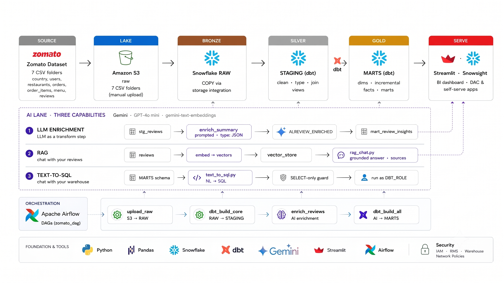

# Zomato Data Engineering & AI Analytics Pipeline
**Developed by Dipayan Sinha**

This project demonstrates a full-scale batch data processing pipeline for Zomato-style food delivery data, transforming raw CSV files into AI-powered insights. 

**Data Flow: Dataset (CSV) → AWS S3 → Snowflake → dbt → Apache Airflow → Gemini**

Raw data lands in an Amazon S3 data lake before being ingested into Snowflake via a secure keyless storage integration. Inside the data warehouse, `dbt` handles the transformations using a medallion architecture: Bronze (RAW tables loaded via `COPY INTO`), Silver (Cleaned STAGING views), and Gold (Business MARTS with dimensions and incremental facts). Apache Airflow orchestrates the entire process as an automated daily DAG. 

The analytics layer is supercharged by Gemini models (`gemini-3-flash-preview` and `gemini-embedding-2`), enabling natural language Text-to-SQL warehouse querying, RAG-based interactions with user reviews, and LLM-enriched sentiment analysis. Streamlit serves as the front-end for these AI applications and dashboards.



> 📂 **Project Assets & Data:** The dataset (~2.3 GB) can be found in this [Google Drive folder](https://drive.google.com/drive/folders/1_dwsOGOMeiklN4Xi6_wAJoQ7-OuKLnQM). Please download the CSV files and place them in the `data/` directory, as they are too large for Git tracking.

## Architecture Overview

| Layer | Environment | Description |
|---|---|---|
| **Source** | `data/` (Local) | Contains 4 dimension CSVs (menu, food, users, restaurants) and 3 generated fact files (10M orders, ~23M order items, 300K text reviews). |
| **Data Lake** | Amazon S3 | Structured with one bucket containing a `raw/<table>/` folder hierarchy. |
| **Bronze Layer** | Snowflake `ZOMATO.RAW` | Ingests data directly from S3 using the `COPY INTO` command via keyless integration. |
| **Silver Layer** | Snowflake `ZOMATO.STAGING` | Contains `dbt` staging views to clean, rename, and type-cast the raw source data. |
| **Gold Layer** | Snowflake `ZOMATO.MARTS` | Hosts business marts, an SCD2 snapshot, dimensions, and incremental facts updated via MERGE. |
| **AI Layer** | Snowflake `ZOMATO.AI` | Features Text-to-SQL, RAG chat capabilities, and LLM-enriched reviews with topics and sentiment. |
| **Orchestration** | Airflow (Docker) | Runs a daily DAG that links the load, transform, enrich, and AI tasks seamlessly. |

## Technology Stack
*   **Data Processing & Storage:** Python, Pandas, Amazon S3, Snowflake
*   **Transformations & Orchestration:** dbt (dbt-snowflake plugin), Apache Airflow 3 (Dockerized)
*   **AI & Presentation:** Gemini(`gemini-3-flash-preview`,`gemini-embedding-2`), Streamlit

## Repository Layout

```text
├── airflow/                  # Dockerized Airflow 3 setup
│   ├── dags/zomato_batch.py  # Pipeline DAG containing 4 main tasks
│   ├── docker-compose.yaml   # Infrastructure config (postgres, api-server, scheduler)
│   ├── Dockerfile            # Includes dbt in a venv, plus Snowflake and OpenAI providers
│   └── example.env           # Template for environment variables (OPENAI_API_KEY, SNOWFLAKE_*)
├── ai/                       # Artificial Intelligence Integration
│   ├── enrich_reviews.py     # LLM sentiment/topic extraction → ZOMATO.AI.REVIEW_ENRICHED
│   ├── rag_chat.py           # Streamlit app: Chat directly with review data
│   ├── text_to_sql.py        # Streamlit app: Query the warehouse using plain English
│   └── example.env           # Template for AI specific credentials
├── aws/                      # IAM roles and trust policies for secure S3 ↔ Snowflake connection
├── snowflake/                # Sequential SQL setup scripts for Snowsight
│   ├── 01_setup.sql          # Configures warehouse (ZOMATO_WH), database, schemas, and roles
│   ├── 02_storage_integration.sql # Configures keyless S3 link
│   ├── 03_stage_and_formats.sql   # Defines external stage and CSV file formatting
│   ├── 04_raw_tables.sql     # DDL for Bronze tables matching CSV columns
│   └── 05_copy_into.sql      # Executes COPY INTO from stage to RAW
└── zomato/                   # dbt transformation project
    ├── macros/               # Custom schema-name macro configuration
    ├── models/marts/         # Gold Layer: Dimensions, incremental facts, and business marts
    └── models/staging/       # Silver Layer: 7 staging views alongside sources and tests
```

## Pipeline Execution Details

1.  **S3 Ingestion**: The seven source CSV files are uploaded into their respective `s3://<BUCKET>/raw/<table>/` folders.
2.  **Secure Snowflake Integration**: A keyless handshake securely connects S3 and Snowflake using an IAM role and a storage integration. 
    *   AWS IAM policies (`s3_read_policy.json`) grant read-only bucket access.
    *   Trust policies (`snowflake-role-trust-policy-initial.json` & `snowflake-role-trust-policy-final.json`) lock down access using the Snowflake IAM user ARN and external ID generated by `DESC INTEGRATION`.
3.  **Data Loading**: The `COPY INTO` command pulls staged S3 files into `ZOMATO.RAW` tables, handling 10M orders, 23M order items, and 300K reviews.
4.  **dbt Transformations (Medallion Architecture)**: 
    *   **Silver (Staging)**: Cleans messy inputs (e.g., stripping currency symbols), lowercases emails, and derives necessary columns.
    *   **Gold (Dimensions & Facts)**: Builds dimensions (food, restaurants, age-segmented customers, date calendar) and processes facts incrementally using a MERGE strategy to avoid rebuilding 10M+ rows daily.
    *   **Testing**: Runs `unique`, `not_null`, `relationships`, and `accepted_values` tests in dependency order to guarantee data integrity.
5.  **Airflow Orchestration**: The `zomato_batch` DAG executes the workflow sequentially (`reload_raw` → `dbt_build_core` → `enrich_reviews` → `dbt_build_ai`). Credentials are kept out of the code and injected dynamically via docker-compose environment variables.
6.  **AI Capabilities**:
    *   **LLM Enrichment**: Uses `gemini-3-flash-preview` as a transformation step to extract structured JSON (sentiment and topics) from reviews, storing it in `ZOMATO.AI.REVIEW_ENRICHED`. This process is sample-capped and idempotent.
    *   **RAG**: Embeds reviews to allow users to ask questions and retrieve answers grounded strictly in actual customer feedback.
    *   **Text-to-SQL**: Translates natural English questions into Snowflake SQL, validated by a SELECT-only execution guard running as `DBT_ROLE` before execution.

## Local Setup & Execution Instructions

**1. Snowflake Configuration**
```bash
# Run the scripts in snowflake/01→05 sequentially in Snowsight to set up warehouse, database, schemas, and S3 storage integration. 
# Refer to aws/iam/ for the required AWS configurations.
```
**2. dbt Setup**
```bash
cd zomato
export SNOWFLAKE_ACCOUNT=... SNOWFLAKE_USER=... SNOWFLAKE_PASSWORD=...
dbt debug && dbt build --exclude tag:ai
```

**3.Airflow Orchestration**
```bash
cd airflow
cp example.env .env          # Populate SNOWFLAKE_* , GEMINI_API_KEY, SAMPLE_N
docker compose build && docker compose up -d
# Navigate to http://localhost:8080 → Un-pause zomato_batch → Trigger the DAG
```

**4. Streamlit AI Applications**
```bash
export GEMINI_API_KEY=sk-...
python ai/enrich_reviews.py
streamlit run ai/rag_chat.py      # Launch RAG app
streamlit run ai/text_to_sql.py   # Launch Text-to-SQL app
```
